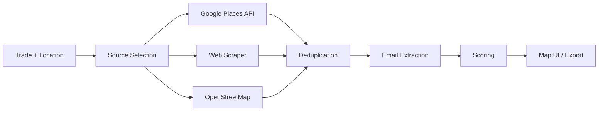

# 🔍 Claude Lead Finder


A local business discovery and lead qualification tool that finds businesses by trade and location using **three discovery sources**, scores them automatically, and exports qualified leads — all in **dependency-free Python**.

This project started as a Google Maps scraping script and was redesigned as a clean, professional portfolio project. The goal is to build a practical lead-finding pipeline that works without paid services, without Docker, and without any AI calls.

---

## 📌 Project Summary

Finding local businesses that could use professional services — a new website, better SEO, a booking system — normally means hours of manual Google searches. This tool automates that process.

It searches across **three sources**, deduplicates results, extracts emails from business websites, and scores every lead on a 0–100 scale. The web UI shows everything on a map with filters, export, and a settings panel.

> No AI. No subscriptions. No Docker. Runs on your machine with your own (optional) API keys.

---

## ✨ Key Features

- ✅ Three discovery sources (Google Places API, web scraper, OpenStreetMap)
- ✅ 17 built-in trade categories with fuzzy matching
- ✅ Deterministic scoring system (0–100, no AI)
- ✅ Email extraction from business websites
- ✅ Multi-signal deduplication (Place ID → phone → domain)
- ✅ Interactive map UI with live SSE search streaming
- ✅ Filter chips: No website · Has website · Has email · Has phone · Social media
- ✅ Export to JSON and CSV (Excel-compatible UTF-8 BOM)
- ✅ Local cache to avoid repeated API calls
- ✅ Settings panel to configure API keys from the browser
- ✅ Claude Code integration with slash commands
- ✅ Portfolio-ready project structure for GitHub

---

## 🗂️ Discovery Sources

The tool searches three sources in priority order. All three deduplicate against each other (Place ID → phone → domain).

| Priority | Source | Needs | Speed | Coverage |
|----------|--------|-------|-------|----------|
| 1 | **Google Places API** | `GOOGLE_PLACES_API_KEY` | ~2 s | Excellent |
| 2 | **Web scraper** | Nothing | 5–15 s | Good |
| 3 | **OpenStreetMap** | Nothing | 5–30 s | Sparse |

`--source auto` (default) tries them in order.

### Google Places API (recommended)

Fast, structured, ToS-compliant. Every result has rating, reviews, phone, website.

1. [console.cloud.google.com](https://console.cloud.google.com/) → Enable **Places API (New)** → Create an API key
2. Set it in `.env`, or paste it in the web UI ⚙️ Settings panel

Google's free tier covers normal personal use.

### Web Scraper (no key needed, always available)

Two modes, same interface:

| Mode | Setup | Quality |
|------|-------|---------|
| **Playwright** (recommended) | `pip install playwright && playwright install chromium` | Full browser rendering, scrolls through results |
| **Stdlib fallback** | Nothing — pure Python | Parses Google web search HTML (limited coverage) |

The scraper auto-detects Playwright. Without it, it falls back to stdlib HTTP parsing.

> **⚠️ Scraping Google violates Google's Terms of Service.** Heavy or repeated use can get your IP temporarily rate-limited. For production, use a Google Places API key.

### OpenStreetMap (zero-setup fallback)

Works with nothing. Coverage is volunteer-mapped and sparse. Fine for testing.

---

## 📊 Scoring System

Every lead gets a deterministic score (0–100, no AI):

| Signal | Points |
|--------|-------:|
| Rating ≥ 4.5 | +18 |
| Rating ≥ 4.0 | +14 |
| 100+ reviews | +18 |
| 50+ reviews | +14 |
| 20+ reviews | +10 |
| **Email found** | **+22** |
| Phone | +8 |
| Address | +4 |
| No website (opportunity) | +12 |
| Google Places source | +4 |
| Exists | +10 |

Ten leads at score 85+ are more useful than 500 names at score 20.

---

## 🔄 Project Workflow



---

## 🚀 Getting Started

### 1. Clone the Repository

```bash
git clone https://github.com/Hesamodinn/claude-lead-finder.git
cd claude-lead-finder
```

### 2. Run the Web UI

```bash
python server.py
```

Opens http://localhost:9100 — a map picker with live search, filters, export, and settings.

### 3. Or Use the CLI

```bash
# Find electricians near Folsom, CA
python scripts/find_businesses.py "Folsom, CA" electrician --review

# See all 17 built-in trades
python scripts/find_businesses.py --list-categories

# Free-text search (needs Google API key or web scraper)
python scripts/find_businesses.py --query "emergency plumber" "Brooklyn, NY"

# Force web scraping only
python scripts/find_businesses.py --source scrape "Miami, FL" dentist --depth 8

# Check social media presence
python scripts/check_presence.py "Acme Plumbing" acmeplumbing.ca
```

Needs Python 3.10+. No `pip install` required — everything is standard library.

### 4. Optional: Install Playwright for Better Scraping

```bash
pip install playwright
playwright install chromium
```

This gives the web scraper full browser rendering. Without it, the scraper still works using stdlib HTTP parsing.

---

## 🖥️ Web UI Features

| Feature | Description |
|---------|-------------|
| Map picker | Click to pin a location (draggable, auto-geocodes to city) |
| Filter chips | No website · Has website · Has email · Has phone · Social media |
| Live log | SSE-streamed search progress with color-coded messages |
| Results table | Sortable, searchable, click to pin on map |
| Export | JSON and CSV (Excel-compatible UTF-8 BOM) |
| Settings | Paste your Google API key right in the browser |
| Local cache | Repeat searches load instantly from disk |
| Source status | See which sources are live at a glance |

The map uses OpenStreetMap tiles. No API key needed for the UI itself.

---

## 🤖 Using it with AI Coding Assistants

The tool works as an **agent skill** — any AI coding assistant that can run terminal commands can use it. The scripts are plain Python with structured JSON output, so they integrate naturally.

### Tested With

| Assistant | How it works |
|-----------|-------------|
| **Claude Code** | Slash commands (`/lead-find`, `/lead-batch`) + skill file auto-triggers on natural language |
| **Cursor** | Agent mode runs the scripts, reads JSON output, presents results |
| **Codex CLI** | Runs scripts directly from the terminal |
| **Windsurf** | Agent executes scripts and formats the output |
| **Cline / Aider** | Any assistant that can call `python scripts/find_businesses.py` works |

All you need is an assistant that can run a shell command and read the JSON it returns. No special API, no plugin, no integration code.

### Claude Code — Slash Commands

| Command | Action |
|---------|--------|
| `/lead-find <trade> in <city>` | Find and qualify businesses, return a scored table |
| `/lead-batch <file> [--city "City"]` | Run many searches as one job |
| `/lead-setup` | Health-check all discovery sources |
| `/lead-jobs` | List cached search results |

### Claude Code — Plain Language

The skill in `.claude/` and `skills/` triggers on natural requests:

- *"Find electricians near Folsom, CA"*
- *"Build me a lead list of dentists in Denver, CO"*
- *"Pull Google Maps listings for plumbers in Phoenix"*
- *"Search for coffee shops in Hamilton, Ontario with email"*

Claude translates your words into the right script call — you never need to remember CLI flags.

### Adding as a Claude Skill

Copy the `skills/lead-finder/` folder into your own project's `.claude/skills/` directory:

```bash
cp -r skills/lead-finder/ /path/to/your-project/.claude/skills/lead-finder/
```

Then any Claude Code session in that project will auto-discover the skill and respond to lead-finding requests.

### Without Any AI

`scripts/find_businesses.py` is a standalone, dependency-free Python CLI. No AI assistant, no account, no subscription needed.

```bash
python scripts/find_businesses.py "Folsom, CA" electrician --review
```

---

## 🛠️ Technologies Used

| Tool | Purpose |
|------|---------|
| Python | Main programming language |
| Playwright | Optional headless browser for Google Maps scraping |
| Leaflet.js | Interactive map UI |
| OpenStreetMap | Map tiles and free business data |
| Google Places API | Optional premium business data |
| Server-Sent Events | Real-time search progress streaming |

---

## 📁 Project Structure

```text
claude-lead-finder/
│
├── README.md                 
├── CLAUDE.md                 Project instructions for Claude Code
├── LICENSE                   MIT
├── .env.example              Config template
│
├── server.py                 Local web server (map UI, SSE search, settings API)
├── map.html                  Interactive map UI (Leaflet, results, export)
│
├── scripts/
│   ├── find_businesses.py    Main search: 3 sources, dedup, scoring, email
│   ├── check_presence.py     Social media presence checker
│   ├── _scraper.py           Direct Google web/Maps scraper (Playwright + stdlib)
│   └── _common.py            Shared helpers (HTTP, geocoding, email extraction)
│
├── skills/
│   └── lead-finder/
│       └── SKILL.md          Claude Code skill definition
│
├── .claude/
│   ├── settings.json         Pre-approved commands for hands-free runs
│   └── commands/             /lead-find, /lead-batch, /lead-setup, /lead-jobs
│
└── data/                     Local cache and exclusions (gitignored)
```

---

## ⚙️ Configuration

Copy `.env.example` to `.env` and fill in what you have:

```bash
# Optional — the tool works without any keys
GOOGLE_PLACES_API_KEY=your-key-here
```

Or set it through the web UI: click ⚙️ Settings on the search page.

---

## 🔒 Responsible Use

The web scraper fetches Google search and Maps pages directly.

- **Start light.** Depth 5 is enough for most searches.
- **Watch for empty results** — it means Google is rate-limiting your IP. Wait a few minutes.
- **Use the Google Places API for production.** It's fast, compliant, and the free tier is generous.
- **Scraping Google violates their Terms of Service.** Your IP may be temporarily limited. Your Google account is not affected.
- Treat output as leads to verify, not a dataset to resell.
- Phones and emails are personal data — follow GDPR, CCPA, and CAN-SPAM.

---

## 🔒 Privacy

Everything runs on your machine. Nothing talks to any server run by the author — only OpenStreetMap, Google's own services (search, Maps, Places API with your key), and business websites (for email extraction). No account, no telemetry, no data collected.

---

## 🔮 Future Improvements

Planned improvements for making this project more advanced:

- Add CRM integration for lead management
- Add email template generation for outreach
- Build a dashboard for lead tracking over time
- Add bulk enrichment from multiple data sources
- Deploy as a web service with user accounts
- Add webhook notifications for high-score leads

---

## 💼 Portfolio Value

This project demonstrates practical experience with:

- Multi-source data aggregation and deduplication
- Web scraping with Playwright and stdlib fallback
- Real-time streaming (Server-Sent Events)
- Interactive mapping with Leaflet.js
- Deterministic scoring algorithms
- CLI and web UI development
- Python project architecture without external dependencies
- API integration (Google Places, OpenStreetMap)

This makes it suitable for showcasing Python engineering and data skills in a GitHub portfolio.

---

## 👨‍💻 Author

**Hesam**
Software Developer

- GitHub: [@Hesamodinn](https://github.com/Hesamodinn)

---

## 📄 License

This project is available under the [MIT License](LICENSE).

---

## 🙌 Acknowledgment

This project uses OpenStreetMap data (© OpenStreetMap contributors, ODbL), Leaflet.js for mapping, and optionally Google Places API for business data. The project has been cleaned and structured as a professional portfolio project for learning, demonstration, and future development.
